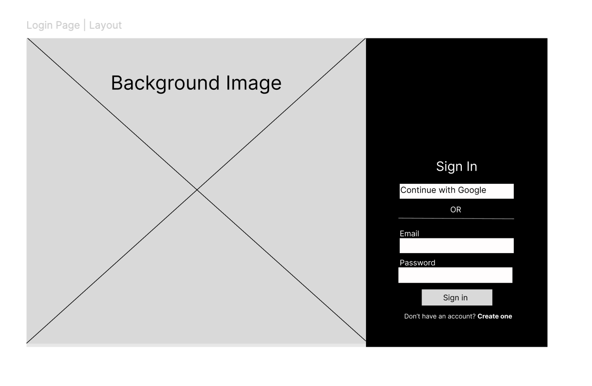
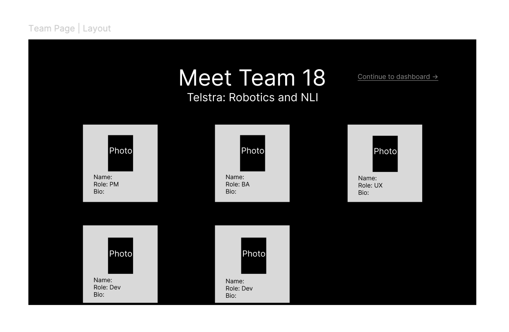

# Login Redesign & Team Page

> Design decisions and layout sketches for the login page redesign and the new team page.

**Jump to:** [Login Redesign](#login-redesign) · [Team Page](#team-page) · [General Rules](#general-rules)

> **Note:** This redesign does not affect any existing functionality. It is purely visual and structural.

## Login Redesign

The login page uses a full-page background image with the login components overlaid on the right-hand third of the screen.

### Layout

- The **background image covers the entire page** (full width and height).
- The background image lives in `frontend/public/images/`
- The login components (email and password inputs) sit in a **panel spanning 1/3 of the screen width**, anchored to the **right-hand side**.
- The remaining 2/3 on the left shows the background image uncovered.

### Behaviour

- No colours change from the current design.
- On successful login, the user is **redirected to the [Team Page](#team-page)**.

## Team Page

A new page introducing the team, shown after login.

### Structure

- **Team name** as an `h1` heading.
- **Project title** as an `h2` heading.
- A **"continue to dashboard"** text link fixed to the **top-right corner**; clicking it redirects the user to the dashboard.
- A grid of **`team-member-card`** components, laid out **3 columns per row**.
- Team member photos are stored in `frontend/public/images/team-pic/`

### Team member cards

Each `team-member-card` contains:

| Element | Description |
|-|-|
| Image | Photo of the team member |
| Name | Team member's name |
| Role | Their role in the project |
| Bio | A brief blurb about them |

Since the team has **5 members**, the cards wrap into two rows: **3 cards on the first row, 2 on the second**.

### Card behaviour

- If a **name is too long**, it wraps onto more than one line. It is **never hyphenated or truncated**.
- If wrapping causes content to overflow the card, the **card size stays fixed** — the card content **scrolls** so the user can read everything.
- If the overall page content does not fit the viewport, the **body extends and the user scrolls down** to see the rest.

## General Rules

These apply across the redesign:

- Every photo **must have alt text** in case it fails to render, following the format: **`Team-member-name photo`** (e.g. `Alice Smith photo`).
- **Image sizes are fixed and must not be altered.** If an image is missing or fails to load, the space allocated for it **remains the same size**.