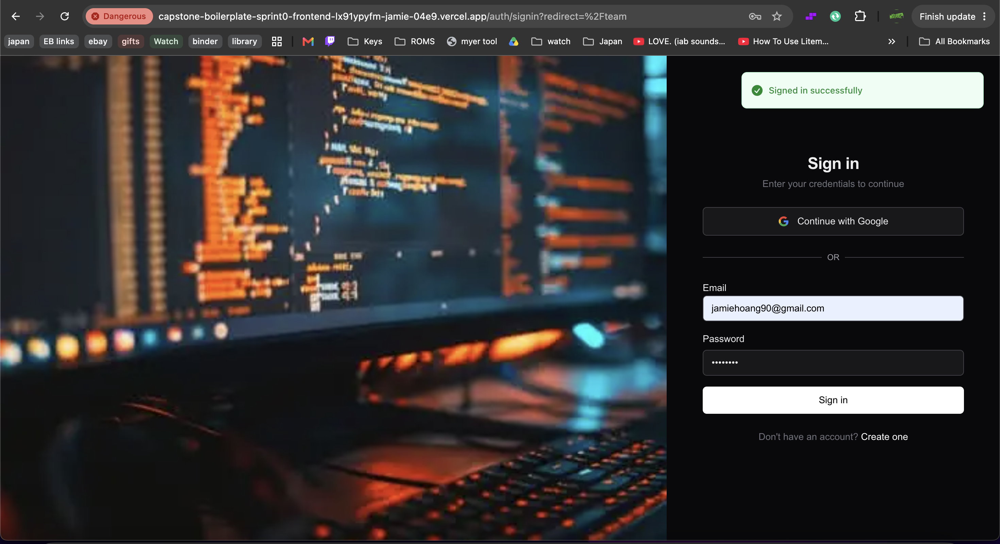
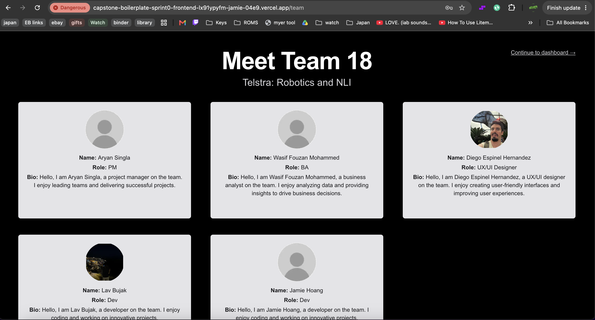
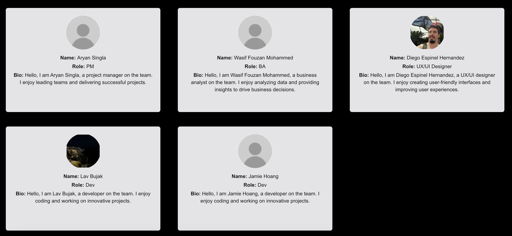
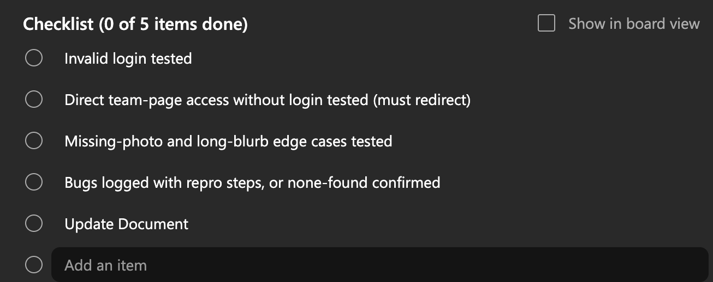
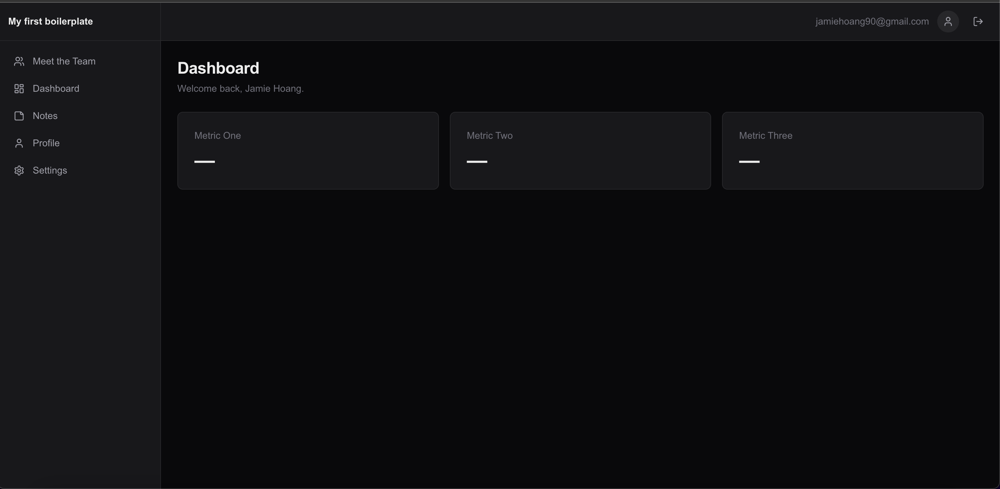

# Test Report: Login → Redirect → Team Page Flow

**Task:** [Login Restyling Bootstrap] Task 6: Test Login → Redirect → Team Page Flow
**Role:** Dev 2:  Jamie Hoang
**Date:** 16 August 2026
**Test script:** `docs/test-script-login-team-flow.md`

## Status

**✅ Done.** All 6 test cases executed on the deployed URL with evidence below. No issues found on the happy path.

## Environment Tested

| Item | Value |
|---|---|
| Deployed URL | `https://capstone-boilerplate-sprint0-frontend-lx91ypyfm-jamie-04e9.vercel.app` |
| Browser | Chrome |
| Test account used | `jamiehoang90@gmail.com` |

## Results

| Test Case | Description | Result | Notes |
|---|---|---|---|
| TC-01 | Valid login redirects to the Team Page | Pass | See evidence below: "Signed in successfully" toast shown, browser lands on `/team`. |
| TC-02 | Team identity content (team name + project name) | Pass | See evidence below: "Meet Team 18" (`h1`) and "Telstra: Robotics and NLI" (`h2`) both visible. |
| TC-03 | Team member cards render required fields (photo, name, role, bio) | Pass | See evidence below: all 5 cards show name, role, and bio; every card has an image (real or placeholder). |
| TC-04 | Photo vs. placeholder fallback | Pass | See evidence below: Aryan Singla, Wasif Fouzan Mohammed, and Jamie Hoang show the placeholder avatar at the same fixed size as the real photos as we can see with Diego and Lav with no broken-image icon or gap. |
| TC-05 | Long content stays inside a fixed-size card (expand/scroll behaviour) | Pass | See evidence below: bio artificially lengthened via DevTools. The card stayed a fixed size, text wrapped without truncation/hyphenation, and a scrollbar appeared so the overflow content scrolls inside the card. |
| TC-06 | Continue to dashboard link | Pass | See evidence below: clicking the link navigates to `/dashboard`. |

## Evidence

### TC-01: Valid login redirects to the Team Page

**Step 1: Sign-in page loaded, credentials entered:**

**Step 4: Redirect confirmed to `/team` after sign-in:**

### TC-02: Team identity content

### TC-03: Team member cards render required fields

**Full grid: all 5 cards with name, role, bio:**

**Close-up: a single card for readability:**

### TC-04: Photo vs. placeholder fallback

Same grid screenshot as TC-03 above shows both cases side by side: Diego Espinel Hernandez and Lav Bujak display real photos, while Aryan Singla, Wasif Fouzan Mohammed, and Jamie Hoang display the placeholder avatar: all at the same fixed image size.

### TC-05: Long content stays inside a fixed-size card

Wasif Fouzan Mohammed's bio was temporarily lengthened via browser DevTools (a live DOM edit only, not a code or data change) to force overflow:

The card border stays the same fixed size, the text wraps onto more lines rather than being cut off or hyphenated, and the scrollbar on the right edge confirms the overflow scrolls inside the card per `docs/DESIGN-LOGIN-AND-TEAM-PAGE.md`'s "Card behaviour" rule.

### TC-06: Continue to dashboard link

**Step 2: Link navigates to `/dashboard`:**

## Checklist (mirrors the Task 6 board card)

- [x] Valid login tested end-to-end on deployed URL
- [x] Redirect to team page confirmed
- [x] All required content verified correct and complete
- [x] Document updated

## Defects Found

None. All 6 test cases passed on the deployed URL with no issues.

## Completion Comment (for the board card)

> Done: Tested the full happy path on the deployed URL: valid login, redirect fires, all member cards render correctly with photo/role/blurb, expand-on-long-text works.
> Deliverable: Test script and test report.
> Note for next role: No issues found on the happy path. Moving on to edge cases next.
