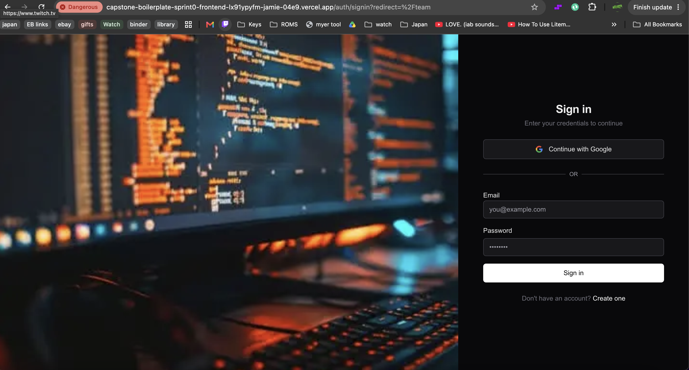
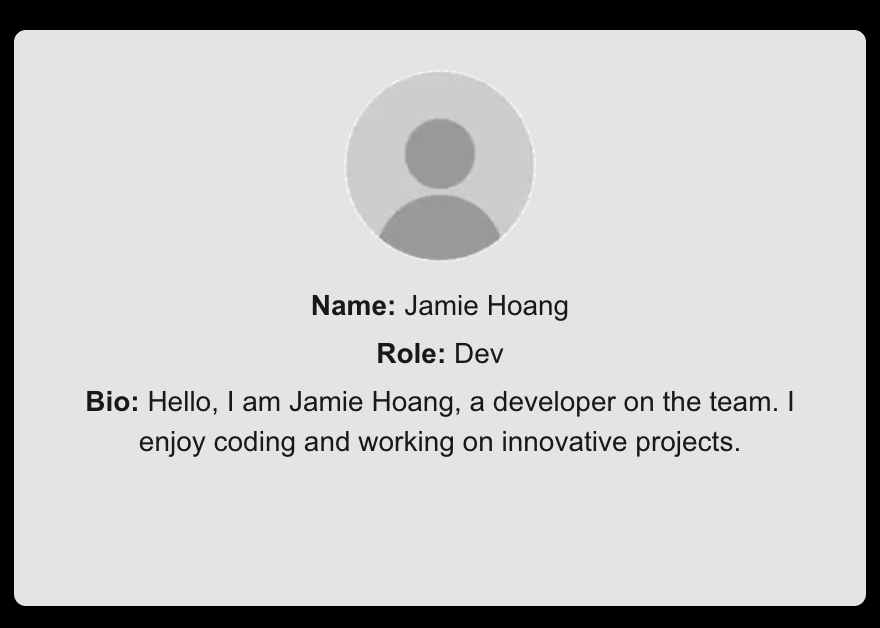
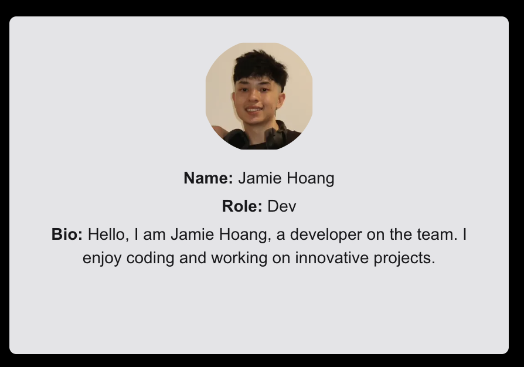
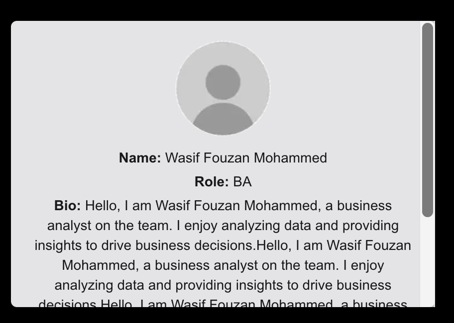
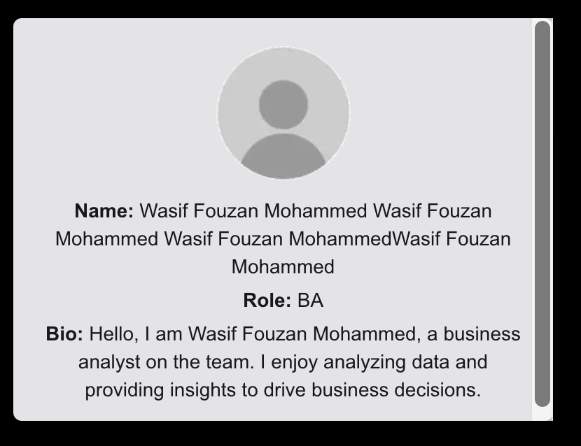

# Edge Case Test Report: [Login Restyling Bootstrap] Task 7

**Task:** [Login Restyling Bootstrap] Task 7: Test Edge Cases & Log Bugs
**Role:** Dev 2: Jamie Hoang
**Date:** 16 August 2026
**Related docs:** `docs/requirements-login-team-page.md` (Edge Cases section), `docs/test-script-login-team-flow.md` / `docs/test-report-login-team-flow.md` (Task 6: happy path)

## Scope

This report covers the edge cases explicitly called out in `docs/requirements-login-team-page.md`:

- Failed login (invalid credentials)
- User trying to access the Team Page without being logged in
- Missing team member photo
- Long team member names / different blurb lengths

All four edge cases have dedicated evidence for this task: EC-01 and EC-02 are genuinely new for Task 7, while EC-03 and EC-04 build on what was touched incidentally during Task 6, re-verified here with fresh screenshots rather than just cross-referencing the old ones.

## Preconditions

| Item | Value |
|---|---|
| Deployed URL | `https://capstone-boilerplate-sprint0-frontend-lx91ypyfm-jamie-04e9.vercel.app/` |
| Test account | `jamiehoang90@gmail.com`: same test account used in Task 6, for confirming what a *wrong* password/email does |
| Browser | `Chrome: 150.0.7871.187` |

## Test Cases

### EC-01: Invalid login is rejected with an error, no redirect

Per `frontend/src/app/(auth)/auth/signin/page.tsx`: a failed `signInWithEmail` call is caught and shows a toast: "Please verify your email before signing in." if the error message contains `email-not-verified`, otherwise a generic "Invalid email or password" toast. No redirect happens in either case.

| Step | Action | Expected Result |
|---|---|---|
| 1 | Go to `https://capstone-boilerplate-sprint0-frontend-lx91ypyfm-jamie-04e9.vercel.app/auth/signin?redirect=%2Fteam` | Login page loads |
| 2 | Enter a valid-format email with an intentionally wrong password | Form submits |
| 3 | Click **Sign in** | "Invalid email or password" toast appears; page stays on `/auth/signin` (no redirect to `/team`) |
| 4 | Enter an email with an invalid format (e.g. `not-an-email`) | Inline Zod validation error appears ("Please enter a valid email address") before the request is even sent |
| 5 | Leave the password field empty and submit | Inline validation error appears ("Password is required") |

### EC-02: Direct `/team` access without being logged in redirects

Per `frontend/src/actions/auth.actions.ts`, `requireAuth()` runs at the top of the Team Page Server Component and calls `redirect('/auth/signin')` if there's no valid session cookie.

| Step | Action | Expected Result |
|---|---|---|
| 1 | Sign out (or open the deployed URL in a private/incognito window with no session) | No `__session` cookie present |
| 2 | Navigate directly to `https://capstone-boilerplate-sprint0-frontend-lx91ypyfm-jamie-04e9.vercel.app/team` (typed URL, not via the app's own links) | Redirected to `/auth/signin`: the Team Page content never renders, even briefly |

### EC-03: Missing team member photo shows a placeholder

Jamie Hoang's card had no `photoPath` set (same as Aryan Singla and Wasif Fouzan Mohammed still do) until a real photo was added partway through this task, which turned out to be a useful natural before/after: the placeholder rendered correctly beforehand, and swapping in a real photo afterward didn't shift the card's dimensions at all.

| Step | Action | Expected Result |
|---|---|---|
| 1 | View the Team Page, find a member with no assigned photo | Placeholder avatar shown, same fixed dimensions as a real photo |
| 2 | Compare against a card whose photo was subsequently added | Card stays the exact same size; no layout shift when the placeholder is replaced by a real photo |

**Status:** Pass: dedicated before/after evidence below.

### EC-04: Long blurb / long name doesn't break the card

| Step | Action | Expected Result |
|---|---|---|
| 1 | Force a long bio via DevTools DOM edit | Card stays a fixed size; text wraps, doesn't truncate/hyphenate; overflow scrolls inside the card |
| 2 | Force a long name via DevTools DOM edit | Name wraps onto multiple lines; not truncated or hyphenated; card layout doesn't break |

**Status:** Pass: dedicated evidence for Task 7 below (long bio and long name both tested independently, on top of Task 6's original TC-05).

## Results

| Test Case | Description | Result | Notes |
|---|---|---|---|
| EC-01 | Invalid login rejected with error, no redirect | Pass | See evidence below: wrong password submitted, "Invalid email or password" toast shown, page stayed on `/auth/signin` (no redirect). |
| EC-02 | Direct `/team` access while logged out redirects | Pass | See evidence below: URL shows `/auth/signin?redirect=%2Fteam`, confirming the app redirected instead of rendering the Team Page. |
| EC-03 | Missing photo shows placeholder | Pass | See evidence below: before/after of Jamie Hoang's card shows the placeholder rendering correctly, then a real photo swapped in at the same fixed size. |
| EC-04 | Long blurb/name stays inside fixed card | Pass | See evidence below: long bio scrolls inside the fixed card; long name wraps onto multiple lines without breaking layout. |

## Evidence

### EC-01: Invalid login rejected

**Wrong password submitted: error shown, no redirect:**

### EC-02: Direct `/team` access while logged out

Navigating directly to `/team` with no session redirected to `/auth/signin?redirect=%2Fteam`: the `redirect` query param confirms the app caught the unauthenticated request and sent the user back to sign in rather than rendering the Team Page:

### EC-03: Missing team member photo shows a placeholder

**Before: placeholder avatar, no photo assigned:**

**After: real photo added, same fixed card size, no layout shift:**

### EC-04: Long blurb / long name doesn't break the card

**Long bio: card stays fixed size, content scrolls internally:**

**Long name: wraps onto multiple lines, card layout intact:**

## Bugs Logged

_List any issues found here with severity and repro steps. If none found, state that explicitly rather than leaving this blank._

None. Both edge cases passed cleanly.

## Checklist (mirrors the Task 7 board card)

- [x] Invalid login tested
- [x] Direct team-page access without login tested (must redirect)
- [x] Missing-photo and long-blurb edge cases tested
- [x] Bugs logged with repro steps, or none-found confirmed
- [x] Update Document

## Completion Comment (for the board card)

> Done: Tested invalid login, direct team-page URL access without login, missing-photo member, and an unusually long blurb. No bugs found.
> Deliverable: Edge case test report.
> Note for next role: PM: everything passed, nothing outstanding for Dev 1 to fix before your review.
